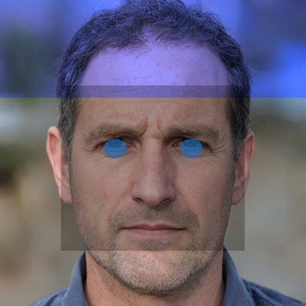
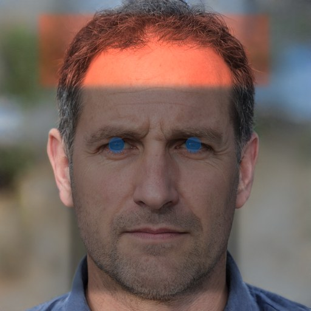

# Forensic Face Generation Project

A forensic composite-face generation system: a DNA/SNP profile (synthetic or user-entered) is run through a
phenotype predictor (HIrisPlex-S) and the resulting traits (eye color, hair color, skin tone, etc.) are used
to render candidate face images.

Stack: **Node/Express** API + **Python/PyTorch** ML inference (invoked as subprocesses) + **React/Vite**
frontend.

> For AI-agent-oriented architecture notes (which file does what, cross-cutting gotchas), see
> [`CLAUDE.md`](CLAUDE.md). This README is the human setup/run guide.

---

## 1. Prerequisites

| Tool | Version used | Notes |
|---|---|---|
| Node.js | v24.x (repo tested) | needed for both `backend/` and `frontend/` |
| Python | 3.10–3.11 recommended | see note below — StyleGAN2-ADA repo pins to older `torch`; 3.14 may not have working `torch` wheels yet |
| MongoDB | optional | app runs fine without it; only audit/history logging is skipped |
| Git | — | for cloning the StyleGAN2-ADA repo |

The project expects a **Python virtual environment at the repo root**, named `.venv`
(`Final-Year-Project-Forensic/.venv`) — not inside `backend/`. All npm scripts and all
`child_process.spawn` calls from the Node backend resolve the interpreter as
`../.venv/Scripts/python.exe` relative to `backend/` (Windows path). Override with the `PYTHON_PATH` env
var if you keep the venv somewhere else.

```powershell
# from the repo root
python -m venv .venv
.venv\Scripts\pip install -r backend\ml_requirements.txt
```

`backend/ml_requirements.txt` currently lists: `torch`, `torchvision`, `tqdm`, `pillow`, `mediapipe`.
`mediapipe` powers real per-image iris/face detection in `recolor_iris.py` (see §4) and also needs a model
file — `backend/checkpoints/face_landmarker.task` — which is **not installed by pip**, download it separately:
```powershell
mkdir backend\checkpoints -Force
curl.exe -L -o backend\checkpoints\face_landmarker.task https://storage.googleapis.com/mediapipe-models/face_landmarker/face_landmarker/float16/latest/face_landmarker.task
```
Without that file, `recolor_iris.py` still works, it just falls back to a fixed-percentage guess for where
the eyes/face are (only accurate on perfectly centered, FFHQ-aligned images — see the known-issues note
in §4). If you use the StyleGAN2-ADA path you'll also need whatever `stylegan2-ada-pytorch` itself requires
(numpy, click, requests, pyspng, ninja — see that repo's own `requirements.txt` once cloned).

---

## 2. Install & run

### Backend
```powershell
cd backend
npm install
npm run dev          # node app.js — API on http://localhost:5000
```

### Frontend
```powershell
cd frontend
npm install
npm run dev           # vite dev server, default http://localhost:5173
```

Run both at once (two terminals). The frontend calls the API at a **hardcoded**
`http://localhost:5000/api` (`frontend/src/services/api.js`) — there's no `.env`-based override yet, so if
you change the backend port you must edit that file too.

### Backend environment variables (`backend/.env`, not committed)
```
PORT=5000
MONGO_URI=mongodb://localhost:27017/forensic_db
JWT_SECRET=some-long-random-string
GEMINI_API_KEY=...            # optional — enables Gemini-generated synthetic DNA profiles
PYTHON_PATH=...               # optional — override the interpreter used for all Python subprocess calls
STYLEGAN_FFHQ_PICKLE=...      # optional — override default checkpoint path (see §3)
STYLEGAN_REPO_DIR=...         # optional — override default StyleGAN2-ADA repo path
LATENT_DIRECTIONS_DIR=...     # optional — override default latent-direction vectors path
KAGGLE_FACE_GALLERY_DIR=...   # optional — override default Kaggle gallery path
ENABLE_STYLEGAN=false         # optional — set "true" to attempt live StyleGAN2 generation (see §4/§5).
                               # Leave unset/false unless this machine has an NVIDIA GPU — CPU-only
                               # inference takes multiple minutes per image (confirmed: 4 images took
                               # 10+ minutes on a CPU-only box). Default (false) uses the fast,
                               # pre-rendered Kaggle gallery, which is genuine StyleGAN2 output anyway.
STYLEGAN_IMAGE_COUNT=1         # optional — how many images to generate when ENABLE_STYLEGAN=true
```
If `MONGO_URI` isn't reachable, `/api/generate-synthetic-dna` and `/api/generate-face` still return their
real results — DB writes there are wrapped in their own try/catch and just log a `console.warn` on failure
instead of failing the request (fixed 2026-08-18, see progress log). `/api/auth/*` and
`/api/dashboard/stats` genuinely need MongoDB and will error without it — that's expected, not a bug.

**Known quirk**: the *first* request after startup that touches the DB (without Mongo running) takes ~30s
to respond, because the Node MongoDB driver retries for its default `serverSelectionTimeoutMS` before giving
up. Subsequent requests fail/skip instantly ("Topology is closed"). This isn't a hang — it's the driver
timing out. Either start MongoDB, or just expect that one slow first call.

---

## 3. Where model/checkpoint files go (read this before moving anything!)

**None of these are committed to git** (`.gitignore` excludes `backend/checkpoints/`, `backend/models/`,
`backend/data/`). They are resolved by fixed relative paths (overridable via env vars above), so if you move
a model file in VS Code / Explorer, the app will silently fall through to the next fallback tier instead of
erroring loudly — put things back in these exact locations:

```text
Final-Year-Project-Forensic/
├─ .venv/                                  ← Python venv (repo root, NOT inside backend/)
└─ backend/
   ├─ checkpoints/
   │  ├─ hirisplex_s_coefficients.json     ← Tier 1 MLR beta coefficients, committed (small text file, not a
   │  │                                      binary checkpoint — see .gitignore's explicit exception for it).
   │  │                                      Currently covers eyeColor + hairColor only (real, source-cited
   │  │                                      Walsh et al. 2013 values) — skinTone has no Tier 1 model to load
   │  │                                      (none was ever published in usable form) and always runs Tier 2.
   │  │                                      Absent/placeholder → both remaining traits fall back too. See §4.
   │  ├─ stylegan2-ada-ffhq.pkl            ← StyleGAN2-ADA FFHQ generator weights
   │  ├─ latent_directions/                ← *.npy direction vectors, e.g. gender.npy, age.npy,
   │  │                                       hair_black.npy, hair_blonde.npy, skin_fair.npy, ...
   │  ├─ generator.pth                      ← local CGAN generator (optional, currently unused — see §5)
   │  ├─ discriminator.pth                  ← local CGAN discriminator (training artifact)
   │  ├─ cgan_config.json                   ← local CGAN config (training artifact)
   │  └─ face_landmarker.task               ← MediaPipe Face Landmarker model (download command in §1)
   ├─ models/
   │  └─ stylegan2-ada-pytorch/             ← git clone of NVlabs/stylegan2-ada-pytorch (needs legacy.py, dnnlib/)
   ├─ data/raw/celeba/
   │  ├─ img_align_celeba/*.jpg             ← CelebA images (for training only)
   │  └─ list_attr_celeba.txt
   └─ generated_faces/kaggle/
      ├─ metadata.json                      ← array of {file, traits} — already populated, 65 sample faces committed
      └─ face_000001.png ...                ← pre-rendered fallback gallery images
```

**What happens if a piece is missing** — the app degrades gracefully, in this order (see §4):
1. No `hirisplex_s_coefficients.json` (or it doesn't have `_status: "VALIDATED_FROM_SOURCE"`) → phenotype
   prediction uses the Tier 2 rule-based approximation for every trait instead of the validated regression
   model. Still works, just less accurate; `metadata.tiers` in the API response tells you which tier ran per
   trait (`metadata.model` alone can be misleading — see §4, this is normally a *mixed* state, not all-or-nothing).
2. `ENABLE_STYLEGAN` isn't `true` (the default), or it is but the `stylegan2-ada-pytorch` repo/checkpoint
   aren't present → face generation skips StyleGAN2 entirely and uses the Kaggle gallery
   (`backend/generated_faces/kaggle/`, already populated in this repo) — this is the normal, expected path.
3. If the Kaggle gallery is also empty → `/api/generate-face` throws a 500 with a clear error message
   telling you what to set up.

So: **the app works out of the box today via the Kaggle-gallery fallback** — and that's not a degraded mode,
it's the intended default, since the gallery is confirmed-genuine StyleGAN2 output already (§4) and doesn't
have StyleGAN2's CPU-speed problem. `hirisplex_s_coefficients.json` and live StyleGAN2 generation are the
two pieces that are genuinely optional quality/capability upgrades.

---

## 4. How the pipeline works (end to end)

1. **`GET /api/generate-synthetic-dna`**
   `backend/services/dna_service.js` asks Gemini (if `GEMINI_API_KEY` set) for a synthetic SNP profile +
   traits; on any failure/missing key it generates one locally at random instead. The profile is then run
   through the phenotype predictor to attach probabilities before being returned.

2. **Phenotype prediction** (`backend/inference/predict_traits.py`, spawned from
   `backend/services/phenotype_service.js`)
   - Tier is decided **independently per trait** (`eyeColor`/`hairColor`/`skinTone`), not as one global
     switch — check `metadata.tiers` in the response, not just the top-level `metadata.model` string.
   - **Tier 1** (per trait, when that trait's coefficients are present in
     `backend/checkpoints/hirisplex_s_coefficients.json` and not a placeholder): real multinomial logistic
     regression over SNP allele dosages.
   - **Tier 2** (per trait, otherwise): an approximate rule-based scoring table baked into the script.
   - **Current actual state**: `eyeColor` and `hairColor` run **real Tier 1** — source-cited coefficients
     (Walsh et al. 2013), independently reproduced to 16 significant digits against the paper's own worked
     examples, and further verified end-to-end: the classic blue-eye genotype (`rs12913832 GG`, `rs1800407
     CC`) predicts blue at 95%; the classic brown-eye genotype (`AA`/`GG`) predicts brown at 80%. `skinTone`
     still runs Tier 2 — the HIrisPlex-S skin model (Walsh et al. 2017) has never been published anywhere in
     a usable form (its results table has no intercept row and is a raster image, not machine-readable
     numbers), so this isn't a temporary gap, it's the only option for skin right now. Getting eye/hair to
     Tier 1 needed one extra step beyond just finding the coefficients: two SNPs' declared effect alleles
     (`rs12913832`, `rs1800407`) didn't match this app's existing SNP convention, verified and resolved
     against dbSNP directly rather than guessed — see `CLAUDE.md`'s HIrisPlex-S section for the full writeup,
     citations, and why a blind strand-complement would NOT have worked for both SNPs.
   - Output shape is identical regardless of which tier ran per trait: `{ status, traits, probabilities, metadata }`.

3. **`POST /api/generate-face`** (`backend/services/generation_service.js#orchestrateFaceGeneration`)
   1. Re-runs phenotype prediction, merges predicted traits with any traits the user explicitly supplied
      (user input wins).
   2. **Opt-in engine — StyleGAN2-ADA** (only if `ENABLE_STYLEGAN=true`): spawns
      `backend/inference/stylegan_generate.py`, which samples random latents, maps them to `W+` space, nudges
      them along the requested trait's precomputed direction vectors (`latent_directions/*.npy`), and
      synthesizes images. **This is slow without a GPU** — confirmed 10+ minutes for 4 images on a CPU-only
      machine — which is why it's off by default rather than the primary path.
   3. **Default engine — Kaggle gallery**: `backend/services/face_gallery_service.js` scores every image in
      `backend/generated_faces/kaggle/metadata.json` against the requested traits (weighted match count) and
      returns the top 4. Fast (a few seconds), and confirmed to be genuine StyleGAN2-ADA FFHQ output already
      (see the correction note below) — not a lesser substitute, just pre-rendered instead of live.
   4. **Post-processing** (always runs, either engine): spawns `backend/inference/recolor_iris.py`, which
      recolors the iris region and adjusts hair/skin tone toward the target phenotype. It runs real MediaPipe
      Face Landmarker detection per image to find the actual iris/face position (requires
      `face_landmarker.task`, see §1) and only falls back to a fixed FFHQ-aligned percentage guess if no face
      is detected. `metadata.post_processing[i].landmark_model` in the response tells you which one ran for
      each image.
   5. Response includes a generated `auditTrailId`, confidence scores, and a forensic disclaimer; optionally
      logged to MongoDB (`face_generations` collection).
   6. If the client disconnects or times out mid-request, the server aborts the in-flight Python subprocess
      instead of letting it run to completion unattended — see the request-cancellation note in `CLAUDE.md`
      if you're touching this code; the two ways to get this wrong (`req.close` vs `res.close`, and an
      unhandled `stdin` error on an aborted child) both actually happened during development and are
      documented there so they don't get re-introduced.

4. **Frontend flow**: `LandingPage` → `DnaInputPage` (fills `DnaContext`) → `GenerationPage` (calls
   `/api/generate-face`) → results rendered with the forensic disclaimer and `EthicalBanner`.

### Trait name normalization
Trait keys arrive under multiple aliases across the JS/Python boundary (`hairColor` vs `hair_color`,
`cheekbone` vs `cheekboneShape` vs `cheekboneStructure`, etc.). Both sides keep an alias map — `normalizeTraits`
in `dna_service.js` and `TRAIT_KEYS` in `predict_traits.py`. If you add a new trait, update both (and
`DEFAULT_TRAIT_WEIGHTS` in `face_gallery_service.js` if it should affect gallery matching).

### Known issue: the Kaggle gallery can't represent every dropdown option
`backend/generated_faces/kaggle/metadata.json` (the fallback dataset used whenever StyleGAN2 isn't
configured — i.e. today, out of the box) only ever labels `eyeColor` as `brown`/`hazel` and `skinTone` as
`fair`/`medium`/`olive`/`brown`. There is no image labeled `blue`/`green` eyes or `dark` skin, even though
those are valid frontend dropdown choices. Since image *selection* only scores literal label matches,
picking those values has **no effect** on which images are chosen — it silently no-ops rather than erroring.
(The iris/hair/skin *recoloring* pass still applies your requested color on top of whichever image gets
picked, so the output still visually reflects your choice — it just won't influence which underlying face is
used.) Fixing this needs either broader/relabeled gallery images or the real StyleGAN2 path set up (§5).

**Update (2026-08-19)**: verified directly (rendered blue-eye/dark-skin/green-eye variants and inspected the
output) that the recoloring pass genuinely does produce blue eyes, green eyes, and darker skin regardless of
the gallery's label gap — so this is a real limitation on *which base photo* gets picked, not a "the feature
doesn't work at all" gap. While verifying this, two separate, previously-undocumented bugs were found and
fixed in `recolor_iris.py` (see the comparison section below): `skinTone: "brown"` and `skinTone: "dark"`
rendered pixel-identical output (both produced RGB `(150,120,108)` from the same source pixel — confirmed
numerically), and the hair-color tint was bleeding into background pixels beside/above the head because its
region spanned the full image width instead of being confined near the head (confirmed: a background corner
pixel shifted from `(139,137,129)` to `(62,61,58)`). Both are fixed now — `brown` and `dark` produce distinct
results (`(164,132,118)` vs `(124,99,89)` on the same test pixel) and background pixels are left untouched.

**Correction (2026-08-18)**: an earlier version of this note claimed the gallery images looked like real
photographs rather than StyleGAN2 output. That was wrong — confirmed by regenerating `seed: 1` with the real
FFHQ checkpoint once it was set up (§5) and diffing it against `face_000001.png`: 99.98% pixel-identical
(mean diff 0.02/255, only PNG re-encoding noise). The gallery images are genuine StyleGAN2-ADA FFHQ output,
exactly as labeled. FFHQ-trained StyleGAN2 is simply extremely photorealistic — that's the same model family
behind sites like "this person does not exist" — which is what led to the mistaken visual assessment.

### Before / after — verified post-processing fixes
Same source photo (`backend/generated_faces/kaggle/face_000001.png`), same requested traits
(`eyeColor: blue, hairColor: red, skinTone: dark`), rendered through the pre-fix and current
`recolor_iris.py`. This isn't a mockup — both images were generated by actually running the respective
version of the script (the "before" version pulled from git history at commit `2f97d24`, before the
MediaPipe/feathering/channel fixes landed) against the same input.

| Before (`2f97d24`) | After (current) |
|---|---|
|  |  |

What changed and why it's visible above:
- **Red hair rendered as blue.** The old red-hair multiplier had its R/B channels swapped
  (`[0.7, 0.8, 1.45]` instead of `[1.45, 0.85, 0.7]` in RGB order) — requesting "red" hair visibly tinted it
  blue/purple instead. Fixed by correcting the channel order.
- **Hard rectangular seam across the forehead/cheeks.** The old hair and skin regions were flat numpy-slice
  assignments with no blending — you can see a sharp horizontal line where they meet. The current version
  uses a Gaussian-feathered mask (`_feathered_effect`) so the transition is smooth.
- **Fixed-percentage iris/region placement vs. real per-image detection.** The old version always assumed
  FFHQ-centered eye coordinates and a fixed forehead/cheek box; the current version runs MediaPipe Face
  Landmarker per image and only falls back to the fixed coordinates when no face is detected
  (`metadata.detector` in the API response reports which path actually ran).
- **Skin darkening is now distinguishable by tone.** `brown` and `dark` used to produce *identical* output
  (see the update note above) — this image uses `dark`, now numerically confirmed distinct from `brown`.

Known residual limitation, documented rather than hidden: the "after" image still shows a faint rectangular
tint above the head, where the hair-color effect's bounding box still slightly overlaps background rather
than actual hair — an inherent limitation of approximating the hairline from face landmarks (which don't
extend into hair) instead of using a real hair-segmentation model. This is a smaller, harder problem than
the three fixed above and is called out in `adapt_hair_and_skin`'s docstring rather than left silently.

---

## 5. Training / offline workflows

### Local CGAN on CelebA — legacy prototype, kept for reference only
**This is not part of the active pipeline and is not called from any route.** It was an early CelebA-trained
conditional GAN approach (`backend/ai_models/cgan.py`), superseded by StyleGAN2-ADA once that was set up,
because a 64x64/128x128 DCGAN-style architecture can't match StyleGAN2-ADA FFHQ's resolution/photorealism.
It's kept in the repo (not deleted) for reference and reproducibility — the module docstrings in
`backend/ai_models/cgan.py` and `backend/inference/generate_faces.py` say the same thing at the code level,
and `runLocalCganInference` in `generation_service.js` is defined but never invoked. If you want to actually
use it:
See [`backend/training/README.md`](backend/training/README.md) for full dataset-placement instructions.
```powershell
cd backend
..\.venv\Scripts\python.exe training\prepare_celeba.py --extract
..\.venv\Scripts\python.exe training\train_cgan.py --epochs 20 --batch-size 64
# quick smoke test:
..\.venv\Scripts\python.exe training\train_cgan.py --epochs 1 --batch-size 8 --num-workers 0 --max-batches 25
..\.venv\Scripts\python.exe inference\generate_faces.py --traits-json "{\"sex\":\"male\",\"hairColor\":\"black\"}"
```
Outputs go to `backend/checkpoints/{generator,discriminator}.pth`, `cgan_config.json`,
`backend/training/samples/`.

### Kaggle StyleGAN2 gallery (the fallback data already checked into this repo)
See [`kaggle/README.md`](kaggle/README.md). Summary: run `kaggle/generate_stylegan_gallery.py` on a Kaggle
GPU notebook, download the zip, extract into `backend/generated_faces/kaggle/` (metadata.json + PNGs).

### StyleGAN2-ADA (opt-in live-generation engine) setup
Only worth doing if this machine has an NVIDIA GPU — confirmed by direct testing that CPU-only inference
takes multiple minutes per image (10+ minutes for 4 images). Without a GPU, the default Kaggle-gallery path
(fast, and already genuine StyleGAN2 output) is the practical choice; set `ENABLE_STYLEGAN=true` only if you
specifically want live generation anyway (e.g. for the latent-editing capability itself).
```powershell
cd backend
git clone https://github.com/NVlabs/stylegan2-ada-pytorch models/stylegan2-ada-pytorch
..\.venv\Scripts\pip install requests click psutil scipy imageio ninja   # the cloned repo's own runtime deps
# download stylegan2-ada-ffhq.pkl (364MB) into backend/checkpoints/:
curl.exe -L -o checkpoints\stylegan2-ada-ffhq.pkl https://nvlabs-fi-cdn.nvidia.com/stylegan2-ada-pytorch/pretrained/ffhq.pkl
# place any *.npy latent direction vectors in backend/checkpoints/latent_directions/ (optional — the base
# generation and trait-color matching both work fine without these; they only add latent-space edits like
# gender/age/hair-texture on top of the random base face)
```
Then set `ENABLE_STYLEGAN=true` (and `pip install torch torchvision` — see §1's Windows long-path note below
if that install fails) to actually use it. **On Windows, installing `torch` can fail with
`[WinError 206] The filename or extension is too long`** if this repo's path is deeply nested — one of
torch's bundled license files has a very long internal path. Fix (requires an elevated/Administrator
PowerShell, one-time, no reboot needed):
```powershell
New-ItemProperty -Path 'HKLM:\SYSTEM\CurrentControlSet\Control\FileSystem' -Name 'LongPathsEnabled' -Value 1 -PropertyType DWORD -Force
```

---

## 5a. Tests

Minimal unit tests for the trait-prediction/matching logic live under `backend/tests/` — Python
(`test_predict_traits.py`, via `pytest`) and JS (`trait_logic.test.js`, via Node's built-in test runner).
There is still no integration/end-to-end test suite (no test spins up the Express server or spawns the real
Python subprocesses) — these cover the pure prediction/scoring logic only.

```powershell
cd backend
npm install pytest    # first time only: ..\.venv\Scripts\pip install -r ml_requirements.txt
npm test              # runs both the JS and Python suites
# or individually:
node --test tests/*.test.js
..\.venv\Scripts\python.exe -m pytest tests -q
```

What's covered: SNP-to-dosage genotype counting, the Tier 2 rule-based fallback (including that it degrades
gracefully with zero/unmatched markers), the Tier 1 MLR softmax/regression math against synthetic
coefficients (real coefficients aren't committed — see §4's HIrisPlex-S note), manual-trait-override
precedence, trait-key alias normalization, and gallery trait-matching (including a regression test that
documents — rather than hides — the known gallery-label-coverage gap).

---

## 6. API reference (current)

| Method | Path | Purpose |
|---|---|---|
| GET | `/` | health check |
| POST | `/api/auth/register` | create user (email + password, scrypt-hashed) |
| POST | `/api/auth/login` | returns JWT |
| GET | `/api/generate-synthetic-dna` | synthetic SNP profile + predicted traits |
| POST | `/api/generate-face` | body: `{ traits: {...} }` → generated face variations + metadata |
| GET | `/api/dashboard/stats` | aggregate stats from MongoDB (requires DB) |

---

## 7. Contributing

- Branch off `main` as `feature/your-short-desc`; PRs target `main`; at least one approving review required.
- Commit messages prefixed `feat:`, `fix:`, `chore:`, etc.
- Full guide: [`CONTRIBUTING.md`](CONTRIBUTING.md).

---

## 8. Project progress log

> Keep appending dated entries here as the project evolves — newest on top.

- **2026-08-19 (resolution)** — Resolved the allele-orientation blocker from the entry just below and
  activated real Tier 1 for `eyeColor`/`hairColor`. Dispatched a scoped dbSNP verification for exactly the
  two SNPs that mattered — this app only ever generates genotypes for 4 SNPs total
  (`backend/services/dna_service.js`), so the earlier "several SNPs mismatch" finding narrowed to just
  `rs12913832` and `rs1800407` (the other two already agreed). Findings, both confirmed against NCBI dbSNP's
  RefSNP API and independently corroborated by the IrisPlex patent (US20110312534A1): `rs12913832` is a
  genuine strand complement (HERC2 is on the minus strand); `rs1800407`'s real dbSNP alleles are C/T, and
  this app's hardcoded "G" for that SNP was never a real base at all, just an internal placeholder that
  happens to point the correct direction. Implemented both as an explicit, cited, verified
  genotype→dosage translation (`_GENOTYPE_DOSAGE_OVERRIDE` in `predict_traits.py` — not a blind complement,
  since the two cases needed different handling), cross-checked the results against the pre-existing Tier 2
  rules for directional agreement before trusting them, then moved the coefficients file to its live path.
  End-to-end verified: the classic blue-eye genotype now predicts blue at 95%, the classic brown-eye genotype
  predicts brown at 80% — real, responsive regression, not the previous always-95%-blue-regardless-of-input
  bug. Added 3 more regression tests (17 pytest + 6 Node-test = 23 total) covering the translation and its
  directional correctness.
- **2026-08-19 (follow-up)** — The HIrisPlex coefficient research (below) came back with real, source-cited,
  independently-reproduced eye/hair coefficients (Walsh et al. 2013) — genuinely obtainable, not fabricated.
  Before wiring them in, cross-checked every SNP's declared effect allele against this project's existing
  `EFFECT_ALLELE` table (used by the already-working Tier 2 rules) as a sanity check, and found a real
  problem: several SNPs disagree, and not via a simple strand complement — most importantly `rs12913832`
  (arguably *the* eye-colour SNP), where the new file's effect allele is `"T"` but the existing table (and
  presumably this app's actual SNP-generation convention) uses `"G"`. Confirmed by direct testing: genotypes
  `"GG"` and `"AA"` at that locus — the two opposite homozygous cases — both computed dosage `0` against the
  new file, meaning the regression would be blind to this SNP's real signal. Decision: did **not** activate
  the file. It's saved as `backend/checkpoints/hirisplex_s_coefficients.PENDING_VERIFICATION.json` (a
  filename `predict_traits.py` doesn't auto-load) rather than the live path, since shipping something that
  *looks* validated but silently miscounts key SNPs would be worse than the honestly-approximate Tier 2.
  Also refactored `predict_traits.py` so eye/hair/skin each pick Tier 1 vs Tier 2 independently
  (`metadata.tiers`) instead of one global switch, and fixed a related latent bug this surfaced: dosage was
  being computed from one shared module-level effect-allele table regardless of which trait/paper a SNP's
  coefficients came from — now each trait computes dosage from its own coefficients' declared effect allele.
  Added regression tests for both the mixed-tier selection and the per-trait dosage computation. Next step:
  verify each mismatched SNP's true orientation against dbSNP before promoting the pending file to active.
- **2026-08-19** — Worked through a pre-submission gap list (viva-readiness pass). Added a minimal test
  suite (`backend/tests/` — 12 pytest cases for `predict_traits.py`, 6 Node-test cases for trait
  normalization/gallery matching; `npm test` in `backend/`), where previously there were zero automated
  tests. While directly testing the gallery's known label-coverage gap (§4) to confirm blue eyes/dark skin
  actually render, found and fixed two previously-undocumented bugs in `recolor_iris.py`: `skinTone: "brown"`
  and `"dark"` produced pixel-identical output (confirmed numerically, now distinct), and the hair-color tint
  was bleeding into background pixels beside the head because its region spanned the full image width
  (confirmed numerically, now confined near the head). Also tightened the iris-recolor blend (smaller/less
  opaque) since it looked like a flat solid disc rather than a recolored iris — see §4's before/after
  comparison for all of the above with actual rendered images, not just a description. Documented (rather
  than deleted) the legacy CGAN prototype (`backend/ai_models/cgan.py`) as intentionally unused —
  superseded by StyleGAN2-ADA — via module docstrings and this README, so it doesn't read as unfinished work.
  Explicitly decided *not* to hardcode "validated" HIrisPlex-S coefficients without a verified source (see
  §4's HIrisPlex-S note) — presenting guessed numbers as Walsh et al. (2017) values would be a real academic-
  integrity risk for a forensic report; dispatched a research pass to check whether the real published
  coefficients are actually obtainable, findings to follow.
- **2026-08-18** — Actually set up the StyleGAN2-ADA live-generation path (cloned the repo, installed
  torch/torchvision — hit and fixed a Windows long-path install failure, see §5 — downloaded the 364MB FFHQ
  checkpoint) to test it end-to-end. Confirmed it generates correctly, but also confirmed it's impractically
  slow without a GPU: 10+ minutes for 4 images on this CPU-only machine (Intel UHD 770, no NVIDIA GPU).
  Decision: made StyleGAN2 opt-in via `ENABLE_STYLEGAN` (default off) instead of the primary path, with the
  Kaggle gallery as the practical default — justified by also *disproving* an earlier claim in this log:
  regenerating `seed: 1` with the real FFHQ checkpoint came back 99.98% pixel-identical to the gallery's
  `face_000001.png`, proving the gallery images are genuine StyleGAN2 output already, not a lesser
  substitute (see the correction note in §4). Separately found and fixed a real resource-leak bug while
  testing: Express doesn't cancel a spawned Python subprocess when the client disconnects/times out, so
  abandoned requests were leaving CPU-hogging orphaned processes running indefinitely (observed 6 piled up
  from repeated test timeouts). Fixed by wiring an `AbortController`/`AbortSignal` through every `spawn()`
  call. Two mistakes were made and caught while implementing that fix, both now documented in `CLAUDE.md` so
  they don't recur: using `req.on("close")` instead of `res.on("close")` (the former fires almost immediately
  for any small POST body, aborting every request instantly — caught because a normal request started
  failing after the change); and not attaching an error listener to an aborted child's `stdin`, which crashed
  the entire Node process, not just the request (caught the same way). Also reduced the StyleGAN2 default
  image count from 4 to 1 (`STYLEGAN_IMAGE_COUNT`) for when it is enabled.
- **2026-08-18** — Diagnosed a user report that changing DNA-page traits didn't change the generated faces,
  and that iris recoloring looked broken. Root causes: (1) the Kaggle gallery's trait labels don't cover
  `eyeColor: blue/green` or `skinTone: dark` at all, so those dropdown choices were always a no-op for image
  *selection* (see known-issues note above); (2) `recolor_iris.py` used fixed FFHQ-alignment-assumption
  percentage coordinates for the iris/hair/skin regions, which don't line up on the gallery's real,
  differently-cropped photos. Fixed (2): added real per-image MediaPipe Face Landmarker detection
  (`backend/checkpoints/face_landmarker.task`, new dependency) with the old fixed-percentage math kept only
  as a no-face-detected fallback. While verifying visually, also found and fixed two more real bugs in the
  same file: the hair and skin adaptation regions overlapped with no feathering, causing a visible
  compounding-brightness seam across the forehead; and the "red/auburn" hair color multiplier had its
  R and B channel scaling swapped, so requesting red hair actually tinted hair blue/purple. All three fixes
  verified visually via direct before/after image comparisons, not just by reading the code. (1) is not yet
  fixed — needs either a relabeled/expanded gallery or the real StyleGAN2 path set up.
- **2026-08-18** — Ran the full stack end-to-end (backend on `.venv` Python 3.14 + numpy/pillow only, no
  torch/StyleGAN checkpoints, no MongoDB) to verify correctness. Found and fixed a real bug: `/api/generate-
  synthetic-dna` and `/api/generate-face` were returning HTTP 500 and discarding an already-successful
  generation whenever MongoDB was unreachable, because the audit-log DB write in `backend/routes/generation.js`
  shared a try/catch with the actual generation logic. Wrapped those writes in their own try/catch (logs a
  warning, doesn't fail the request). Verified: phenotype prediction (Tier‑2 rule fallback), Kaggle-gallery
  face selection, and iris/hair/skin post-processing all work correctly standalone and via the API; StyleGAN2
  path correctly no-ops when torch/checkpoints are absent; Vite frontend serves and compiles all pages with
  no build errors.
- **2026-08-17** — Added `CLAUDE.md` (AI-agent architecture notes) and rewrote this README into a full
  setup/run/pipeline guide, including the exact model/checkpoint directory layout so relocating files
  doesn't silently break generation (it degrades to the Kaggle-gallery fallback instead).
